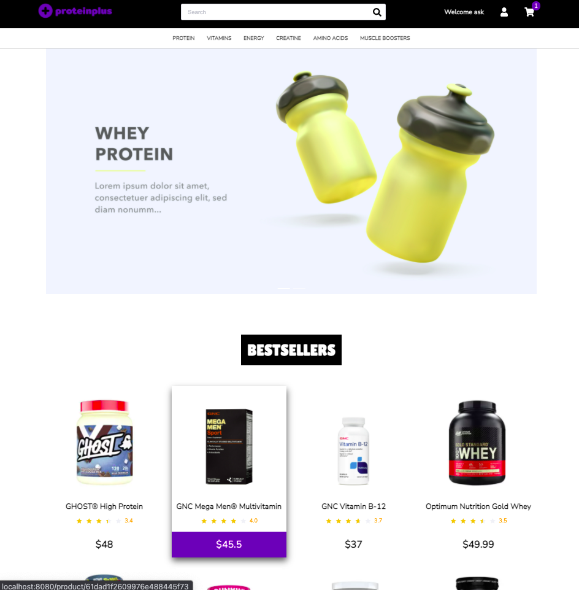
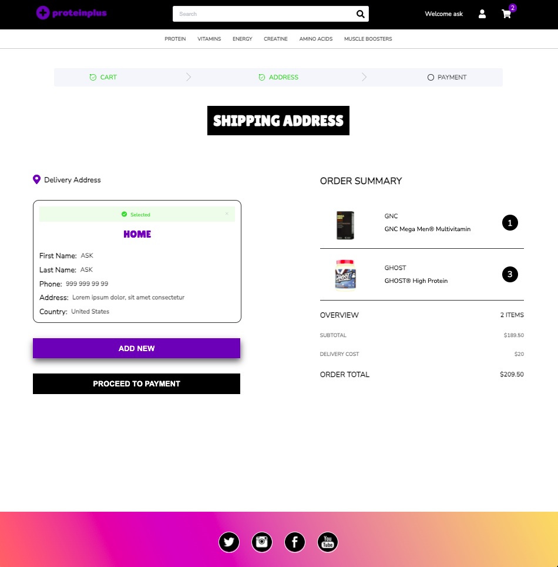

<p align="center">
   
</p>

# proteinplus

> Supplement Store

<br />

<p float="left">
  
  
</p>

---

# :construction_worker: Installation

You need to install Node.js first, then in order to clone the project via HTTPS, run this command:

`git clone https://github.com/ASK-v1/proteinplus.git`

SSH URLs provide access to a Git repository via SSH, a secure protocol. If you have a SSH key registered in your Github account, clone the project using this command:

`git clone git@github.com:ASK-v1/proteinplus.git`

## Install dependencies

### Backend

```
cd backend
npm install
```

### Frontend

```
cd frontend
npm install
```

## Running Development Web Server

### Backend

`npm run start`

### Frontend

`npm run serve`

# :dna: Tech Stack


